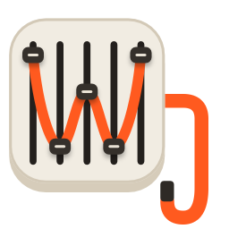
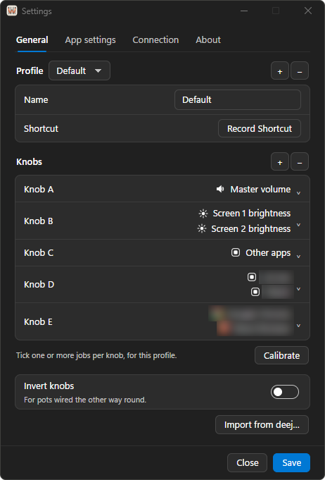

<p align="center">
  
</p>

<h1 align="center">WeeJ</h1>

<h3 align="center">Real knobs for your PC.</h3>

<p align="center">
  The Windows client for <a href="https://github.com/omriharel/deej">deej</a>. Volume for Windows and your apps, brightness and more,<br>
  straight from the mixers on your desk: a deej Arduino, an SMC-Mixer or any MIDI controller.
</p>

<p align="center">
  <a href="https://github.com/zolferfigueiredo/weej/releases/latest"></a>
  <a href="https://go.dev"></a>
  
  <a href="LICENSE"></a>
  <a href="https://github.com/zolferfigueiredo/weej/actions/workflows/ci.yml"></a>
</p>

<p align="center">
  <a href="https://github.com/zolferfigueiredo/weej/releases/latest"><b>Download for Windows</b></a> (64-bit and 32-bit)
  &nbsp;·&nbsp;
  <a href="https://weej.zolfer.com">Website</a>
  &nbsp;·&nbsp;
  <a href="https://github.com/zolferfigueiredo/theej">TheeJ, on macOS</a>
</p>

<p align="center">
  
</p>

## Install

1. [Download `WeeJ-<version>-x64-setup.exe`](https://github.com/zolferfigueiredo/weej/releases/latest), or `WeeJ-<version>-x86-setup.exe` on 32-bit Windows 10, and run it. It installs for your user only, so it needs no administrator rights, and it can launch WeeJ at login.
2. The installer isn't code-signed, so SmartScreen may say "Windows protected your PC". Click **More info**, then **Run anyway**.
3. Open WeeJ. It asks which language to use, starting from Windows' own. Its icon sits in the tray: if you don't see it, open **Show hidden icons** on the taskbar and drag it next to the clock.
4. Plug in your boards. Settings opens and asks how many you have, then adds each in turn: its name and type, and for an Arduino or another MIDI controller, its port and a short calibration. An SMC-Mixer needs none. The Boards tab then sets what each knob, fader and button does.

Coming from deej? Add your Arduino, then **Import…** under its profile in the Boards tab reads your `config.yaml` as a profile, each slider's jobs on the knob of its input.

Coming from WeeJ 1.x? 2.0 starts fresh: it doesn't read 1.x settings, so add your boards again.

Or take the portable [`WeeJ-<version>-x64.zip`](https://github.com/zolferfigueiredo/weej/releases/latest) (or `-x86.zip`) and unzip it anywhere.

You need:

- Windows 10 or 11, 32-bit or 64-bit.
- Any deej board, over USB. Your Arduino sketch stays as it is.
- Or an M-VAVE SMC-Mixer, or any other MIDI controller Windows lists as a MIDI input, over USB or Bluetooth. Use as many boards as you like.
- The Microsoft Edge WebView2 Runtime, for the Settings windows. Windows 11 has it, and on Windows 10 it comes with Edge. WeeJ tells you if it's missing.
- For external screens: monitors with DDC/CI turned on in their own menu.

**Quit deej first.** Only one app can open a board's port at a time; while another one has it, WeeJ shows the port as in use by another app. **Quit Twinkle Tray, Monitorian or any similar app** before you give a knob a screen: two apps writing the same screen over DDC/CI fight over the value.

## Features

- **Any number of boards.** deej Arduinos, M-VAVE SMC-Mixers and other MIDI controllers side by side, each with its own port, settings, profiles and calibration, and each switched on or off on its own.
- **One knob, several jobs.** The volume of Windows, your mic, one app, the focused app or every other app, a screen's brightness or contrast, Night light, a keyboard backlight, screen zoom. Tick several, of any kind, and they all follow the knob. A fader does the same.
- **Buttons that do things.** Play, pause and skip, mute an app or the mic, press a shortcut, open an app or a website, lock the PC, turn off the screens or switch profiles, from any button on a board.
- **An on-screen indicator.** A flyout in the style of Windows 11's own shows up on the display the knob controls, with the app's own icon for an app's volume. Switching profiles shows the new profile's name.
- **A short calibration.** Adding an Arduino or a MIDI board takes every knob and fader to 0%, then to 100%, then each back to 0% in turn, and each button pressed three times. WeeJ learns which input each one is, which way it turns and where its ends are.
- **Profiles on a shortcut.** Each board has its own profiles, switched from the tray or with a shortcut from any app. One shortcut can switch several boards at once.
- **No jumps.** A knob takes up a new job the next time you move it, so switching profiles never jumps the volume or a screen.
- **Real per-app volume.** Windows keeps a volume for every app, and WeeJ turns that same slider you see in the Volume mixer. Nothing is captured or delayed.
- **Follows your audio device.** Switch outputs or inputs, Bluetooth headphones included, and the knobs follow.
- **Button lights on the SMC-Mixer.** 29 patterns, from Fire and Rain to a binary clock, and three EQs that move with whatever your PC plays. A button lights up while you hold it, and a strip's LED blinks while you turn its knob.
- **Any number of knobs.** As many as your sketch sends, named A to Z, then A2, B2 and on. Pots wired the other way round need nothing: calibration sees which way each one turns.
- **Same firmware.** Speaks the deej serial protocol, unchanged, at 9600 baud or whatever your sketch uses.
- **Speaks 12 languages.** Deutsch, English, Español, Français, Italiano, Polski, Português, Русский, Українська, 中文, 日本語 and 한국어. **Language** in the menu and in Settings changes it at once, open windows included.
- **Lives in the tray.** A left click opens Settings and a right click opens the menu. It reconnects on its own, can launch at login, and installs updates in one click.

## What a knob can do

- **Master volume**: the default output device, through Windows Core Audio.
- **Microphone volume**: the default input device, the same level as in Sound settings.
- **System sounds**: Windows' own notification and alert sounds.
- **An app's volume**: an app picked under Apps, through its own Windows audio session, the slider the Volume mixer shows. Apps lists the apps that make sound: the ones playing right now, well-known players, browsers and call apps you have installed, open or not, and any app already on a knob. **Other…** at its end picks any program. An app that starts playing gets the knob's level within a second.
- **Focused app**: whichever app owns the window in front, as deej's `deej.current` does.
- **Other apps**: every app that has no knob of its own in the active profile, as deej's `deej.unmapped` does.
- **Built-in display brightness**: a laptop's panel, through WMI. Desktops have none.
- **Screen brightness** and **Screen contrast**: each external screen over DDC/CI, one entry per screen Windows reports. Screens count left to right by their position in Display settings.
- **Night light warmth** (Experimental): off at the bottom of the knob, then from least to most warm. It is Windows' own Night light, so a schedule still switches it on and off at its set times.
- **External keyboard backlight**: a QMK keyboard with VIA, such as a Keychron K8 Pro, on its USB cable (not Bluetooth). Nothing is saved to the keyboard, so unplugging it brings back its own level. The knob sets brightness only.
- **Screen zoom**: 1x at the bottom of the knob, up to 10x at the top, with the pointer kept in view as it moves. It's the Windows full-screen magnifier, driven directly. Quitting WeeJ zooms back out.

The volumes follow the knob as it turns. Everything else waits for the knob to settle, as described under On-screen feedback.

## What a button can do

- **Media**: Play/pause, Play, Pause, Stop, Previous track, Next track, Volume up, Volume down and Mute all sound.
- **Apps**: open an app, close an app, or open a website.
- **System**: mute the microphone, press a shortcut, turn Night light on or off, turn off the screens, lock the PC or put it to sleep.
- **WeeJ**: the previous or next profile, a profile by name, open Settings, and on an SMC-Mixer the next, previous, on or off button lights.
- **Function keys**: F13 to F24, keys no keyboard has, so another app can bind one without a clash.
- **Knobs**: mute what one of the board's knobs or faders controls.

## How it works

Upstream deej already runs on Windows; WeeJ is a different take on the same idea. It's the Windows sibling of [TheeJ](https://github.com/zolferfigueiredo/theej): one Go program that speaks the same serial protocol and adds MIDI mixers, profiles, calibration, more jobs and Settings windows.

- It reads the deej serial protocol at 9600 baud by default (a board's settings set another speed), however many values the sketch sends. Automatic finds the board among the USB serial ports no other board uses, and it reconnects when it's unplugged.
- **MIDI boards** go through Windows' own MIDI. An SMC-Mixer's controls are known; any other controller's are learned by calibration. The SMC-Mixer's button lights are MIDI notes sent back to it, and its EQ patterns listen to what your output device plays.
- The **volumes** go through Windows Core Audio: the endpoint volume for the output and input devices, and audio sessions for apps and system sounds.
- **External screens** go over DDC/CI through the Windows Monitor Configuration API, one write at a time. The **built-in display** goes through WMI.
- **Night light** is stored by Windows in an undocumented setting, so a future Windows update could break it. That's why it's marked Experimental.
- **Screen zoom** uses the Magnification API, and a **VIA keyboard's backlight** goes over USB HID.
- The tray icon, its menu and the indicator are native Win32. The Settings, Language and Update windows are pages in WebView2, laid out like Windows 11's own Settings and following its light or dark theme and accent color.
- **Check for updates…** asks GitHub for the newest release and sends nothing about you. An update downloads that release's zip, checks it against the release's SHA-256, and installs only into the installed copy (`%LOCALAPPDATA%\Programs\WeeJ`).
- Only one copy runs at a time. Opening WeeJ again while it runs brings up Settings, which is the way back with the tray icon hidden.

<details>
<summary><b>The tray icon</b></summary>

The icon is WeeJ's app icon, drawn in code in [internal/draw](internal/draw). Pointing at it names each connected board with its profile.

A left click, or Enter on the focused icon, opens Settings. A right click opens the menu: each board that is on, with its name and port or status, its profiles with a check by the active one and each one's shortcut, and Calibrate (not on an SMC-Mixer). Then Settings, Language and Reconnect, then Launch at login, About WeeJ, which opens the About tab of Settings, Check for updates… with Check automatically (daily, weekly by default, or never), and Quit WeeJ. Settings can leave the profiles out of the menu, or hide the icon altogether.

</details>

<details>
<summary><b>Settings and calibration</b></summary>

**Settings** has three tabs, laid out in groups as Windows Settings is: **General** for your boards and the app, **Boards** for what each board's controls do, and **About**.

**General** has **Language** at the top left and your boards under it. Each board's row has a switch on the left that turns the board on or off, its name, its status (Connected in green, Disconnected or Off) and a gear for its settings. The very first time, with no boards yet, it asks how many you have and adds each in turn, and **Add board** adds one more. On the right is the **Tray icon** group: **Hide tray icon** removes the icon (open WeeJ again to get back to Settings), and **Profile list** puts each board's profiles in the menu.

**Add board** asks for a name and a type: **DIY (Arduino)**, **SMC-Mixer** or **Other MIDI**. A DIY board also asks for its COM port and baud rate, an Other MIDI board for its MIDI input, and both for how many knobs, faders and buttons it has; calibration follows. A port or input another board uses says so. An SMC-Mixer's controls are known, so it is ready at once.

**The gear** opens a board's settings: its name, its type (fixed once added), its port with Refresh and Reconnect, and its status. **Port** is Automatic, which finds the board among the ports no other board uses, or a fixed one. A DIY board adds **Baud rate**, which must match `Serial.begin()` in your sketch, and **Speed**, how long a knob has to be still before its change lands: Slow (0.3 seconds, recommended), Medium (0.22), Fast (0.18) or Super fast (0.15). The volumes are not affected; they always follow the knob. An SMC-Mixer has **Button lights**. **Next profile** and **Previous profile** take a shortcut each. **Calibrate** runs the calibration again (not on an SMC-Mixer), and **Remove board** asks first, since the board's profiles and calibration go with it.

**Boards** lists the boards that are connected on the left, each with its gear, and shows the one picked on the right, starting with its **profile**: a name, the jobs of every control, and an optional keyboard shortcut. The menu picks the profile you are editing, + adds one, and - removes the one shown. To set a shortcut, click Record Shortcut and press it: it needs Ctrl or Alt with a key, Delete clears it and Escape cancels. Several boards can share a shortcut, and one press then switches all of them; each one notes "Also used by" and the other boards. **Export…** saves the profile shown to a file, and **Import…** reads such a file, or a deej `config.yaml`, as a new profile of the board, kept with Apply. A deej config's sliders land on the knobs on their inputs (its `com_port` is left out on purpose, because WeeJ finds the board by itself and Windows can renumber ports).

Below the profile, **Draw** and **List** show the board two ways. **Draw** shows it as it sits on your desk: an SMC-Mixer as itself, and a DIY or MIDI board with the controls it was set up with, which the arrows move into the places they sit on your desk; **Find it** finds a control's input again. **List** shows three cards side by side, Knobs, Faders and Buttons, each showing ten at a time and scrolling past that. Either way, clicking a knob or fader opens a menu of the jobs under [What a knob can do](#what-a-knob-can-do), each with its icon. Clicking a job ticks it and clicking it again unticks it, so one knob can do several at once, of any kind: two screens' brightness, or an app's volume and a keyboard backlight. Clear unticks them all. Clicking a button opens the actions under [What a button can do](#what-a-button-can-do) in the same way. Moving or pressing a control lights it up on the page, so you can tell which is which.

**About** shows the version, with Check for updates…, and links to the website, to zolfer.com and to TheeJ, WeeJ's sibling on macOS.

**Apply** saves at once, makes each board's profile shown its active one, and leaves the window open. It stays greyed out until something differs from what's saved, and goes grey again once applied or when a change is undone. The switch, Add board, Remove board, the gear's own Save and the language take effect at once, without Apply. A knob given a new job, by Apply or by switching profiles, takes it over the next time you move it.

**Calibration** learns each control of a DIY or MIDI board: which input it is, which way it turns and where its ends are. It runs after Add board, and **Calibrate** in the board's gear or in the tray menu runs it again:

1. Turn every knob and fader to 0%, and press **Next**.
2. Turn every knob and fader to 100%, and press **Next**. Each one's two ends give its travel and which way it turns, so a pot wired the other way round just works.
3. Then one control at a time: turn a knob or fader back to 0%, which tells WeeJ which one it is, or press a button three times. A press on another button starts the count again.

Moving a control that is already found says which one it is. Skip leaves a control as it was, Start again goes back to the 0% step, and Cancel leaves everything as it was. Once every control is found, Finish keeps them. The board's controls hold still for the whole run.

</details>

<details>
<summary><b>On-screen feedback</b></summary>

Turning a knob shows a flyout like the one Windows shows for its own volume keys, on the display that knob controls: a speaker, microphone, sun, half-filled circle, moon, keyboard or magnifying glass, or the app's own icon, with the level. It follows the light or dark theme. Switching profiles shows the profile's name the same way.

The indicator tracks the knob live. Everything but the volumes only changes once the knob has been still for a moment (the Speed setting), so a turn lands as one clean change when you let go instead of flickering a screen through every position on the way. The volumes follow the knob immediately.

</details>

<details>
<summary><b>Jumpy knobs</b></summary>

If a knob's level jumps around while you turn it, the pot's track is oxidised. The wiper loses contact for anywhere from 15ms to a few hundred ms and the Arduino reads a stray value, often near the ends of travel. It builds up on knobs that rarely move, which is why the volume knob stays clean.

Sweep the knob slowly from end to end a dozen or so times. A drop of potentiometer contact cleaner makes it last. Screens and lights are protected meanwhile: everything but the volumes only applies once the knob settles, so a stray reading shorter than the Speed setting's wait never reaches them. If a screen flashes on a faster Speed, go back to Slow.

</details>

## Build from source

Needs Windows 10 or 11 and Go 1.27 (`winget install GoLang.Go`).

```bash
run.bat
```

`run.bat` quits any running copy it built, builds with `build.bat` and runs the new build in the terminal, where it prints live knob values so you can see which physical knob is which input. Its first run also turns on the repository's git hook, which refuses commits made directly on `main`. `build.bat` runs the tests, draws the icons, embeds them and the version into the exe and produces `build\WeeJ.exe`.

```bash
run.bat COM6                  # force a specific port
go test ./...                 # run the tests
installer.bat                 # build dist\WeeJ-<version>-x64-setup.exe on this PC
```

`installer.bat` needs Inno Setup 6 (`winget install JRSoftware.InnoSetup`).

**Run at login.** The installed copy turns this on with **Launch at login** in the menu. For a build run from this folder, `install.bat` starts it at login and restarts it if it crashes, logging to `%TEMP%\weej.log`; `install.bat --uninstall` removes it. Quit from the menu really does quit.

**Release.** Raise `AppVersion` in [version.go](internal/core/version.go), merge to `main`, then run `release.bat` on `main`. It tags the commit `v<version>`, pushes the tag and prints the installer's download link, and the [release workflow](.github/workflows/release.yml) builds and publishes the installers and zips for 64-bit and 32-bit Windows, `latest.json` and checksums as a GitHub release. It refuses a tag that isn't on `main`, so a release is always merged code. It runs on a Windows runner, so it also runs the tests of the Windows-only packages.

**CI** runs on Linux for every pull request: the tests, and golangci-lint and a build for 64-bit and 32-bit Windows. It also checks the git hook with shellcheck, keeps em and en dashes out of the translations, and fails a pull request that changes the app without raising `AppVersion`.

<details>
<summary><b>Tuning</b></summary>

Your boards, what each control does and which input it is on live in Settings, not in source. A fresh install has no boards, and Settings asks for them. Settings are stored as JSON in `%APPDATA%\WeeJ\settings.json`: delete it and restart WeeJ to start over. The log is `%LOCALAPPDATA%\WeeJ\weej.log`.

Constants, then rebuild:

- `Speed.Settle`, in [setup.go](internal/core/setup.go): `0.3`, `0.22`, `0.18` and `0.15` seconds, the waits behind the Speed setting. Every knob but the volumes applies only once it has been still this long. This is also what hides wiper contact bounce, where a moving pot briefly reports its neighbour's value for up to about 0.11s, so keep every one above that.
- The `cal…` constants, in [calwizard.go](internal/core/calwizard.go): how far apart an input's 0% and 100% readings have to be for calibration to take it as a knob or fader, and how far a control has to move to be found.

Turning a brightness knob fully down sets the backlight to 0, and a contrast knob at 0 leaves a screen close to black. The knob is the way back.

</details>

## Disclaimer

Unofficial, not affiliated with deej or Microsoft.

## License

[MIT](LICENSE)

---

<p align="center">
  If WeeJ is useful to you, please consider giving it a ⭐<br>
  It helps other deej builders find it. Thank you!
</p>

<p align="center">
  Made with ❤️ for the deej community by <a href="https://zolfer.com">zolfer.com</a>
</p>
